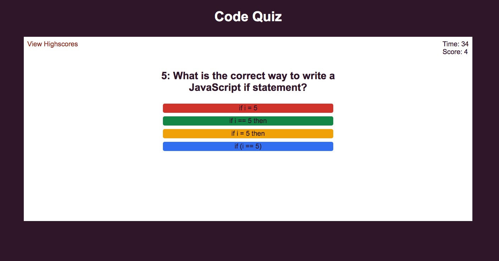

# Code Quiz

## A simple coding quiz app which offers multiple choice answers, using JavaScript and CSS to interact with the html elements on the page

<!-- TABLE OF CONTENTS -->
<details>
  <summary>Table of Contents</summary>
  <ol>
        <li><a href="#about-the-project">About The Project</a></li>
        <li><a href="#deployment">Deployment / Code Repository</a></li>
        <li><a href="#screenshot">Screenshot</a></li>
        <li><a href="#scope-and-purpose">Scope and Purpose</a></li>
        <li><a href="#usage">Usage</a></li>
        <li><a href="#installation">Installation</a></li>
        <li><a href="#pseudocode">Pseudocode</a></li>
        <li><a href="#overview-of-build">Overview of Build</a></li>
        <li><a href="#suggested-future-changes">Suggested Future Changes</a></li>
        <li><a href="#license">License</a></li>
      </ol>
</details>

<!-- About the Project -->
## About the Project

### Deployment / Code Repository

[Live deployment](https://tweetingcynical.github.io/code-quiz/)

[Repository](https://github.com/TweetingCynical/code-quiz)

### Screenshot

Working version of site should look like this at standard screen size:


### Scope and Purpose

Build an interactive coding quiz with a series of multiple choice questions. The quiz should track the user's score, allow them to click a button to select their answer, and also track the time they have left. Finally, the user should be able to save their score to a high score page, and reset all stored scores on click of a clear button.

### Usage

This site and its codeset are for educational purposes only.

### Installation

N/A

<!-- Pseudocode and overview of build -->
## Pseudocode

Steps to achieving the working quiz:

* Set an intial timer of 60 seconds, and a score of 0;
* When user clicks start button:
  - Timer begins countdown;
  - Start screen set to hide;
  - Remove questions class 'hide';
  - h2 tag reads: QUESTION *ONE*;
  - Four buttons for answer choices appear next to content of answers;
* When user clicks correct answer:
  - Timer +=5;
  - Score ++;
  - Display next question;
* When user clicks incorrect answer:
  - Timer -+5;
  - Score no change;
  - Display next question;
* When either no more questions, or timer == 0, game ends:
  - Hide questions; 
  - Display end screen and score;
* When user submits initials:
  - Add score and initials to saved highscores object;
  - Display highscores page, listing stored scores in descending order from top;
    - This may require a for loop to append new child, and then access each child by index, assigning the text content by highest in the stored object;
* When user clicks Go Back, return to initial state;
* When user clicks clear Highscores, empty stored score and initial history.

## Overview of Build

Some of the key JavaScript skills being utilised:

* Use of an object of objects for storing a scalable question bank;
* Use of query selectors to get elements by id and class:

  ```javascript
  qBtn = document.querySelectorAll(".choice")
  const questionsScreen = document.querySelector('#questions')
  ```

* Use of for loops to create a set of buttons:

  ```javascript
  for(let i = 0; i < addQs.length; i++) {
    let opt = document.createElement('button');
    questionChoices.appendChild(opt).setAttribute("class", "choice");
  }
  ```

* Use of another for loop to supply each button with an event listener and its question/answer content. Also use of event.target to match the click target to its id:

  ```javascript
  for(let i = 0; i < qBtn.length; i++) {
  qBtn[i].setAttribute("id", addQs[i]);
  qBtn[i].addEventListener("click", function(event){
    if(event.target === this) {
      let answer = event.target.getAttribute('id');
      let correct = questions[currQ].correct;
      compareAnswers(answer, correct)
    }
  });
  ```

* Use of object.keys to allow indexing into an object:

  ```javascript
  let key = Object.keys(questions)
  ```

* Use of a timer to run every 1000ms:

  ```javascript
  function setTime() {
    let timerInterval = setInterval(function() {
      timeLeft--;
      if (timeLeft <= 0) {
        timerDisplay.textContent = 0;
        clearInterval(timerInterval)
        endQuiz()
      } else {
        timerDisplay.textContent = timeLeft;
      }
    }, 1000);
  }
  ```

* Use of functions to track multiple changing variables and display them on screen:

  ```javascript
  function addTime() {
    timeLeft +=5;
    currScore ++;
    scoreDisplay.innerText = currScore;
  }
  ```

* Use of add and remove classes to show and hide different on screen sections:

  ```javascript
  questionsScreen.classList.add("hide");
  endScreen.classList.remove("hide");
  ```

* Use of JSON parsing and stringify to store variables to local storage:

  ```javascript
  let storedHighScores = JSON.parse(localStorage.getItem("highScoresArray"));
  localStorage.setItem("highScoresArray", JSON.stringify(highScoresArray));
  ```

* Use of the sort function to sort the high scores leaderboard:

  ```javascript
  function sortArray(storedHighScores) {
  storedHighScores.sort((a,b) => {
    return (b[1] - a[1])});
  }
  ```

* Use of a while loop to remove the first child until there are none remaining:

  ```javascript
  while (highScoresOL.firstChild) {
    highScoresOL.removeChild(highScoresOL.firstChild)
  }
  ```

* Use of event listener to call a function:

  ```javascript
  clearBtn.addEventListener("click", clearHighScores)
  ```

### Suggested future changes

- ✅ ~~Store how many seconds the user has left at the end of the game, for use in the high score board~~
- Add sounds for correct and incorrect answers
- Add visual feedback for if answer is correct or incorrect
- Build in data feedback of performance, e.g.
  - number of questions answered
  - ratio of correct to incorrect to unanswered
  - average time taken per question
  - display detail of question responses

## License

MIT License

Copyright (c) 2022 TweetingCynical

Permission is hereby granted, free of charge, to any person obtaining a copy of this software and associated documentation files (the "Software"), to deal in the Software without restriction, including without limitation the rights to use, copy, modify, merge, publish, distribute, sublicense, and/or sell copies of the Software, and to permit persons to whom the Software is furnished to do so, subject to the following conditions:

The above copyright notice and this permission notice shall be included in all copies or substantial portions of the Software.

THE SOFTWARE IS PROVIDED "AS IS", WITHOUT WARRANTY OF ANY KIND, EXPRESS OR IMPLIED, INCLUDING BUT NOT LIMITED TO THE WARRANTIES OF MERCHANTABILITY, FITNESS FOR A PARTICULAR PURPOSE AND NONINFRINGEMENT. IN NO EVENT SHALL THE AUTHORS OR COPYRIGHT HOLDERS BE LIABLE FOR ANY CLAIM, DAMAGES OR OTHER LIABILITY, WHETHER IN AN ACTION OF CONTRACT, TORT OR OTHERWISE, ARISING FROM, OUT OF OR IN CONNECTION WITH THE SOFTWARE OR THE USE OR OTHER DEALINGS IN THE SOFTWARE.